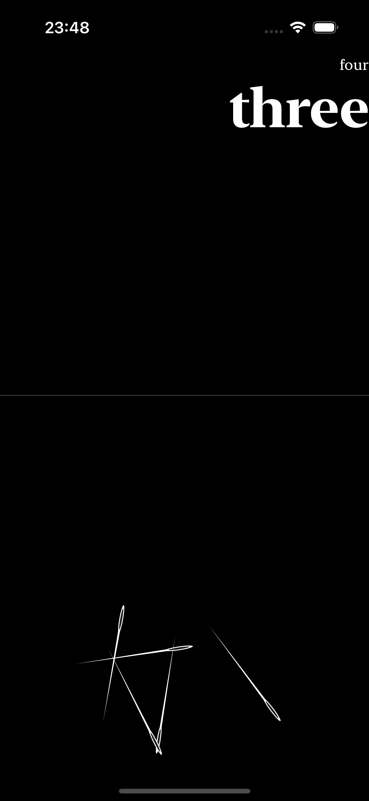
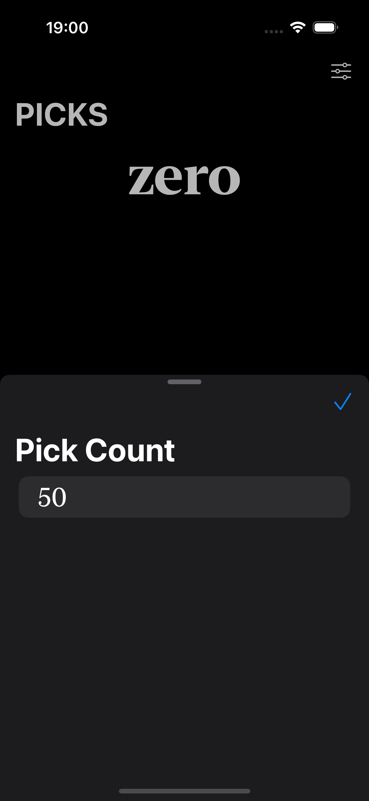

# Pick - SwiftUI Game

## Overview

Pick is a SwiftUI-based game where users interact with "Needles" and score points based on their actions. The game features a dynamic UI with options to customize the number of needles and display scores in words.

## Features

- **Dynamic Needle Views**: Interact with needle objects that appear on the screen.
- **Score Tracking**: View your score in both numeric and word formats.
- **Customization**: Adjust the number of needles using the settings sheet.
- **Winning Condition**: The score resets and a congratulatory message appears when all needles are picked.

## Screenshots

  
  
  
*Description of what the screenshot shows.*

## Installation

1. **Clone the repository**:

    ```sh
    git clone https://github.com/OmPreetham/pick.git
    ```

2. **Navigate to the project directory**:

    ```sh
    cd pick
    ```

3. **Open the project in Xcode**:

    ```sh
    open Pick.xcodeproj
    ```

4. **Build and run the project** in Xcode.

## Usage

1. **Start the Game**: Launch the app in the iOS Simulator or on a physical device.

2. **Interact with Needles**: Drag the needle views to score points.

3. **Adjust Needles**: Tap the settings icon in the top right corner to adjust the number of needles.

4. **View Score**: The current score is displayed in numeric and word formats at the top of the screen.

5. **Win Condition**: When all needles are picked, the score resets, and a "YEYY! You Picked All" message is displayed.

## Code Structure

- **PlayView.swift**: Contains the main game view with score display, needle management, and settings sheet.
- **NeedleView.swift**: Handles the individual needle views and their interaction logic.
- **EditView.swift**: Manages the settings sheet for adjusting the number of needles.
- **Stand.swift**: Represents the static elements or background of the game.

## Contributing

Contributions are welcome! Please follow these steps:

1. Fork the repository.
2. Create a new branch for your changes.
3. Make your modifications.
4. Submit a pull request with a clear description of the changes.

## License

This project is licensed under the [MIT License](LICENSE).
